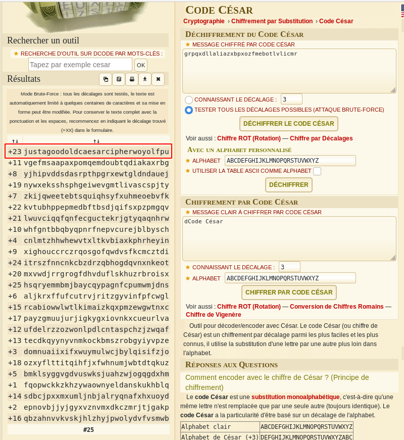

# caesar cipher 1
## Question
>This is one of the older ciphers in the books, can you decrypt the [message](files/ciphertext)? You can find the ciphertext in `/problems/caesar-cipher-1_3_160978e2a142244574bd048623dba1ed` on the shell server. 

## Hint
>caesar cipher [tutorial](https://learncryptography.com/classical-encryption/caesar-cipher)

# Solution
We are told that the message (`grpqxdllaliazxbpxozfmebotlvlicmr`) is encrypted with the Caesar algorithm. Now, we don't know the offset.

Let's use [dcode.fr](https://www.dcode.fr/chiffre-cesar) to brute force it:

With an offset of `+23`, we obtain a good candidate: `justagoodoldcaesarcipherwoyolfpu`

# Flag
`picoCTF{justagoodoldcaesarcipherwoyolfpu}`
