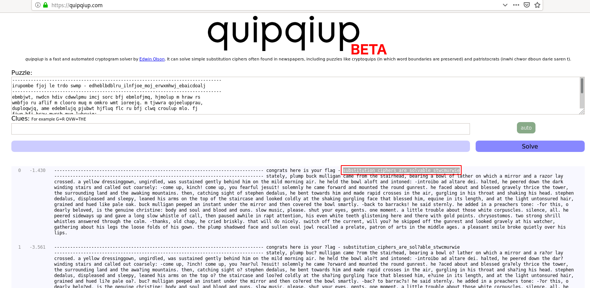

# hertz
## Question
>Here's another simple cipher for you where we made a bunch of substitutions. Can you decrypt it? Connect with `nc 2018shell.picoctf.com 14928`.

## Hint
>NOTE: Flag is not in the usual flag format

# Solution
Let's connect to get the encrypted message:
~~~~
$ nc 2018shell.picoctf.com 14928
-------------------------------------------------------------------------------
irupombe fjoj le trdo swmp - edheblbdblru_ilnfjoe_moj_erwxmhwj_ebaicdoalj
-------------------------------------------------------------------------------
ebmbjwt, nwdcn hdiv cdwwlpmu imcj sorc bfj ebmlofjmq, hjmolup m hraw rs
wmbfjo ru aflif m clooro muq m omkro wmt ioreejq. m tjwwra qojeelupprau,
duploqwjq, ame edebmlujq pjubwt hjfluq flc ru bfj clwq croulup mlo. fj
fjwq bfj hraw mwrsb muq lubrujq:

-luborlhr mq mwbmoj qjl.

fmwbjq, fj njjojq qrau bfj qmov aluqlup ebmloe muq imwwjq rdb irmoejwt:

-ircj dn, vluif! ircj dn, trd sjmosdw gjedlb!

erwjcuwt fj imcj sroamoq muq crdubjq bfj orduq pduojeb. fj smijq mhrdb
muq hwjeejq pomxjwt bfolij bfj brajo, bfj edoorduqlup wmuq muq bfj
mamvlup crdubmlue. bfju, imbiflup elpfb rs ebjnfju qjqmwde, fj hjub
bramoqe flc muq cmqj omnlq ioreeje lu bfj mlo, pdopwlup lu fle bformb
muq efmvlup fle fjmq. ebjnfju qjqmwde, qlenwjmejq muq ewjjnt, wjmujq
fle moce ru bfj brn rs bfj ebmloimej muq wrrvjq irwqwt mb bfj efmvlup
pdopwlup smij bfmb hwjeejq flc, jydluj lu lbe wjupbf, muq mb bfj wlpfb
dubruedojq fmlo, pomlujq muq fdjq wlvj nmwj rmv.

hdiv cdwwlpmu njjnjq mu luebmub duqjo bfj clooro muq bfju irxjojq bfj
hraw ecmobwt.

-hmiv br hmoomive! fj emlq ebjouwt.

fj mqqjq lu m nojmifjoe bruj:

-sro bfle, r qjmowt hjwrxjq, le bfj pjudluj ifolebluj: hrqt muq erdw
muq hwrrq muq rdue. ewra cdeli, nwjmej. efdb trdo jtje, pjube. ruj
crcjub. m wlbbwj bordhwj mhrdb bfrej aflbj irondeiwje. elwjuij, mww.

fj njjojq elqjamte dn muq pmxj m wrup ewra aflebwj rs imww, bfju nmdejq
maflwj lu omnb mbbjublru, fle jxju aflbj bjjbf pwlebjulup fjoj muq bfjoj
albf prwq nrlube. ifoterebrcre. bar eborup efolww aflebwje mueajojq
bfordpf bfj imwc.

-bfmuve, rwq ifmn, fj ioljq holevwt. bfmb alww qr ulijwt. ealbif rss
bfj idoojub, alww trd?

fj evlnnjq rss bfj pduojeb muq wrrvjq pomxjwt mb fle ambifjo, pmbfjolup
mhrdb fle wjpe bfj wrrej srwqe rs fle prau. bfj nwdcn efmqrajq smij muq
edwwju rxmw graw ojimwwjq m nojwmbj, nmboru rs mobe lu bfj clqqwj mpje.
m nwjmemub eclwj horvj ydljbwt rxjo fle wlne.
~~~~

Let's use https://quipqiup.com/ to brute force it:

It reveals the flag: `substitution_ciphers_are_solvable_stwcmurwie`

# Flag
`picoCTF{substitution_ciphers_are_solvable_stwcmurwie}`
