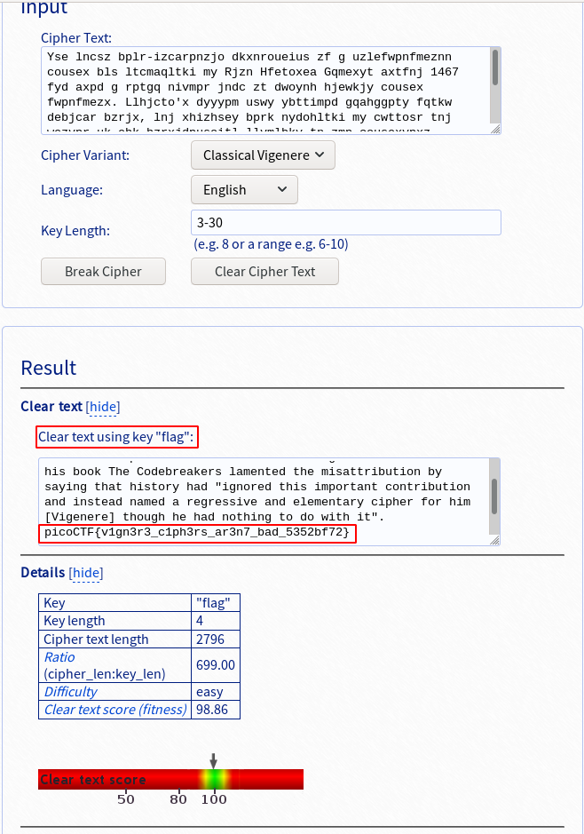

# blaise's cipher
## Question
>My buddy Blaise told me he learned about this cool cipher invented by a guy also named Blaise! Can you figure out what it says? Connect with `nc 2018shell.picoctf.com 11281`.

## Hint
>There are tools that make this easy.

>This cipher was NOT invented by Pascal

# Solution
When we connect to the resource, it displays an encrypted message where we can guess the `picoCTF{...}` flag is located somewhere in the middle:
~~~~
$ nc 2018shell.picoctf.com 11281
Encrypted message:
[SNIP]
Hqliyj oe Bnretjce vzmloxsej mts jjdcxnatoty ol f disnwax gft yycotlpr gzeoqjj cousex gpfuwp tnj noawe ol Mpnxd TIO tq Fxfyck, ny 1586. Lgypr, os ehk 19ys ckseuxd, ehk nyvkseius zf Hjwlgxz's inahkw hay rtsgyerogftki eo Bnretjce. Jfgij Plht ny hox moup Ehk Hzdkgcegppry qlmkseej yse sndazycihzeius my yfjitl ehgy siyyzre mld "olyoxjo tnnd isuzrzfyt itytxnmuznzn gso itxeegi yasjo a xjrrkxdibj lnj jwesjytgwj cousex kzr nnx [Volpnkwp] tntfgn mp hgi yozmtnm yz du bttn ne". pohzCZK{g1gt3w3_n1pn3wd_ax3s7_maj_5352gq72}
[SNIP]
~~~~

Let's use https://www.guballa.de/vigenere-solver to break this encryption:

It reveals that the encryption was Vigenere (Blaise de Vigenere) with the key `flag`

# Flag
`picoCTF{v1gn3r3_c1ph3rs_ar3n7_bad_5352bf72}`
