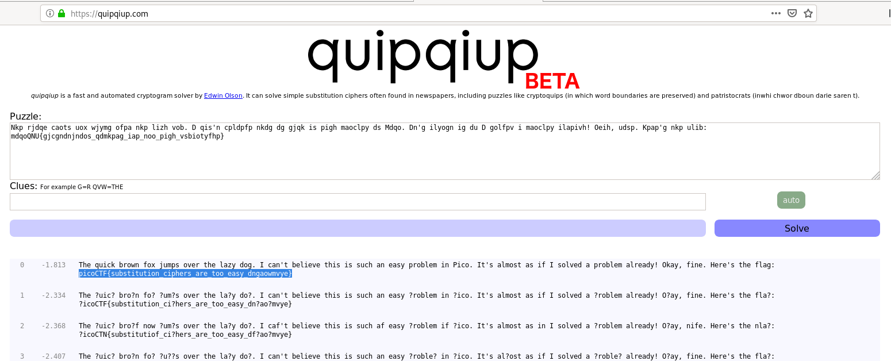

# hertz 2
## Question
>This flag has been encrypted with some kind of cipher, can you decrypt it? Connect with `nc 2018shell.picoctf.com 18990`.

## Hint
>These kinds of problems are solved with a frequency that merits some analysis.

# Solution
Here is the encrypted message:
~~~~
$ nc 2018shell.picoctf.com 18990
Let's decode this now!
Nkp rjdqe caots uox wjymg ofpa nkp lizh vob. D qis'n cpldpfp nkdg dg gjqk is pigh maoclpy ds Mdqo. Dn'g ilyogn ig du D golfpv i maoclpy ilapivh! Oeih, udsp. Kpap'g nkp ulib: mdqoQNU{gjcgndnjndos_qdmkpag_iap_noo_pigh_vsbiotyfhp}
~~~~

We can use https://quipqiup.com/ to solve this challenge:

# Flag
`picoCTF{substitution_ciphers_are_too_easy_dngaowmvye}`
