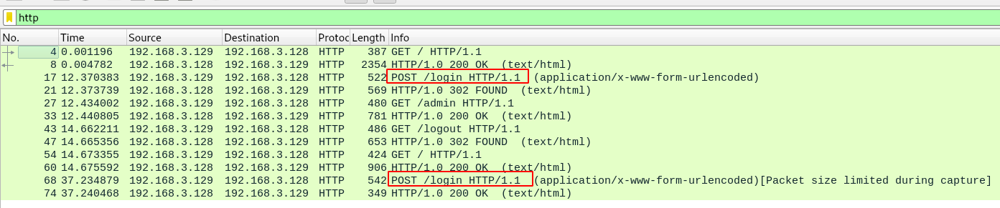

# admin panel
## Question
>We captured some [traffic](files/data.pcap) logging into the admin panel, can you find the password? 

## Hint
>Tools like wireshark are pretty good for analyzing pcap files.

# Solution
The quick and lazy way of solving this problem is to use the `strings` command:
~~~~
$ strings data.pcap | grep pico
user=admin&password=picoCTF{n0ts3cur3_894a6546}
~~~~

Now, let's dive into the analysis. Open the capture in Wireshark and filter the HTTP traffic. You'll see that there are 2 `POST` requests to `/login`:

Following the HTTP Stream (right click > follow > HTTP Stream) reveals credentials, but the `user` is not `admin`:
~~~~
POST /login HTTP/1.1
Host: 192.168.3.128
User-Agent: Mozilla/5.0 (X11; Ubuntu; Linux x86_64; rv:59.0) Gecko/20100101 Firefox/59.0
Accept: text/html,application/xhtml+xml,application/xml;q=0.9,*/*;q=0.8
Accept-Language: en-US,en;q=0.5
Accept-Encoding: gzip, deflate
Referer: http://192.168.3.128/
Content-Type: application/x-www-form-urlencoded
Content-Length: 28
Connection: keep-alive
Upgrade-Insecure-Requests: 1

user=jimmy&password=p4ssw0rd
~~~~

Let's follow the HTTP stream of the second `POST` request to `/login`:
~~~~
POST /login HTTP/1.1
Host: 192.168.3.128
User-Agent: Mozilla/5.0 (X11; Ubuntu; Linux x86_64; rv:59.0) Gecko/20100101 Firefox/59.0
Accept: text/html,application/xhtml+xml,application/xml;q=0.9,*/*;q=0.8
Accept-Language: en-US,en;q=0.5
Accept-Encoding: gzip, deflate
Referer: http://192.168.3.128/
Content-Type: application/x-www-form-urlencoded
Content-Length: 53
Connection: keep-alive
Upgrade-Insecure-Requests: 1

user=admin&password=picoCTF{n0ts3cur3_894a6546}
~~~~

The password is actually the flag we're looking for

# Flag
`picoCTF{n0ts3cur3_894a6546}`
