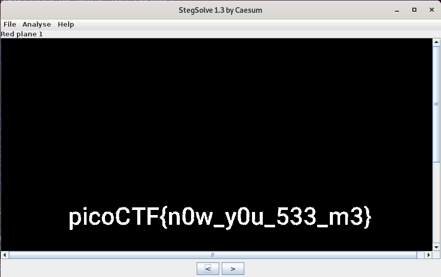

# now you don't
## Question
> We heard that there is something hidden in this [picture](files/nowYouDont.png). Can you find it?

## Hints
>There is an old saying: if you want to hide the treasure, put it in plain sight. Then no one will see it.

>Is it really all one shade of red?

# Solution
Guided by the hints, we decide to use [StegSolve](https://www.aldeid.com/wiki/Stegsolve):

# Flag
`picoCTF{n0w_y0u_533_m3}`
