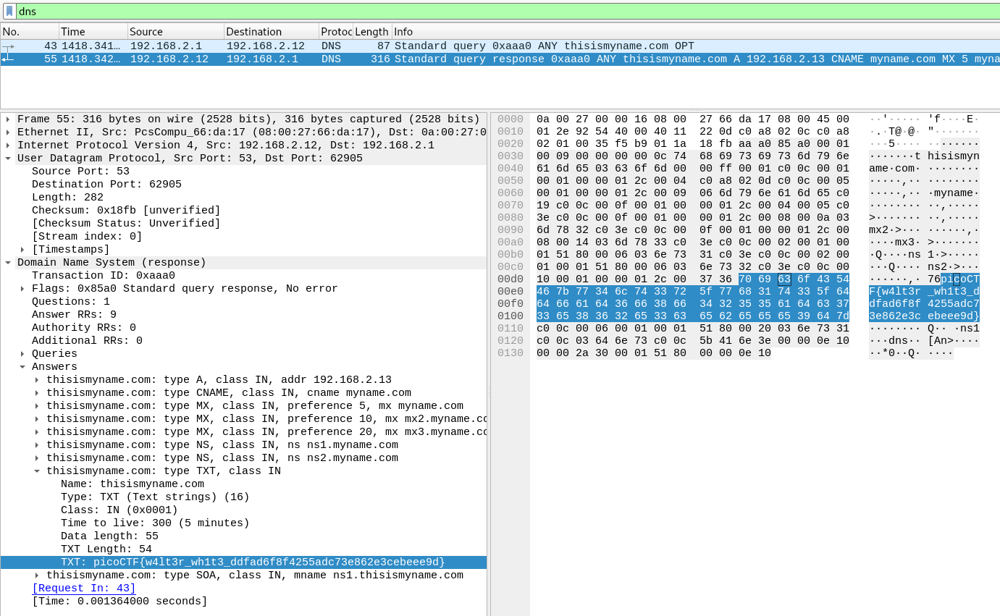

# What's My Name?
## Question
>Say my name, say [my name](files/myname.pcap).

## Hint
>If you visited a website at an IP address, how does it know the name of the domain?

# Solution
You can simply run `strings` to reveal the flag:
~~~~
$ strings myname.pcap | grep pico
76picoCTF{w4lt3r_wh1t3_ddfad6f8f4255adc73e862e3cebeee9d}
~~~~

Else, open the capture in `Wireshark` and filter the `DNS` traffic (the hint helps):

# Flag
`picoCTF{w4lt3r_wh1t3_ddfad6f8f4255adc73e862e3cebeee9d}`
