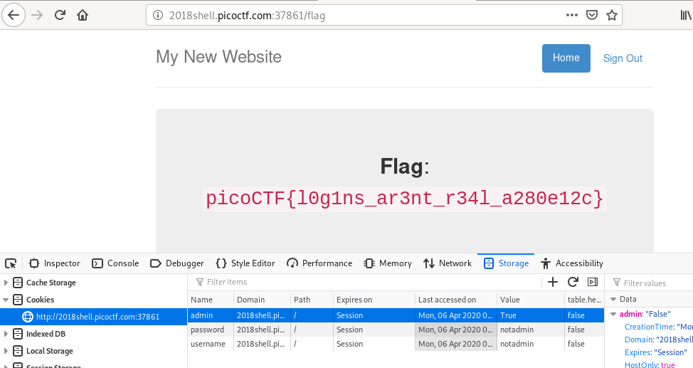

# Logon
## Question
> I made a website so now you can log on to! I don't seem to have the admin password. See if you can't get to the flag. http://2018shell.picoctf.com:37861 [(link)](http://2018shell.picoctf.com:37861/)

## Hint
>Hmm it doesn't seem to check anyone's password, except for admins?
>How does check the admin's password?

# Solution
Connect to the website and try to enter `admin` and `password` respectively for the username and password. The following message appears: "I'm sorry the admin password is super secure. You're not getting in that way".

Now, if you try to login as `notadmin` with any password, you will get a different message: "Success: You logged in! Not sure you'll be able to see the flag though."

Throw the developper bar (`Ctrl`+`Shift`+`I`) and navigate to Storage > Cookies. You'll notice that a cookie named `admin` has been created, set to `False`. Force it to `True` and refresh the page (`F5`). Now, you'll see the flag.

# Flag
`picoCTF{l0g1ns_ar3nt_r34l_a280e12c}`
