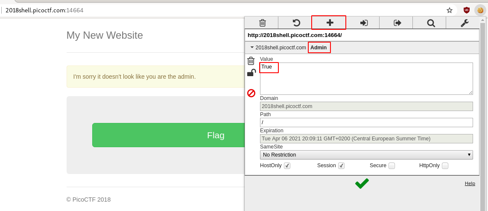
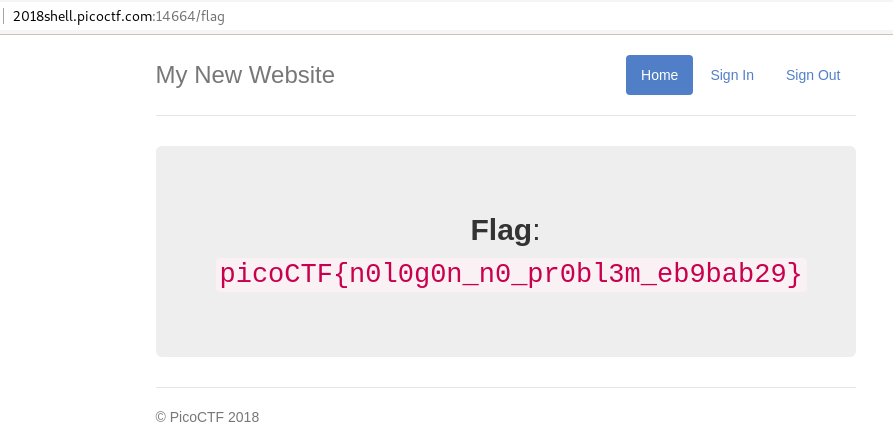

# No Login
## Question
>Looks like someone started making a website but never got around to making a login, but I heard there was a flag if you were the admin. `http://2018shell.picoctf.com:14664` ([link](http://2018shell.picoctf.com:14664/)) 

## Hint
>What is it actually looking for in the cookie?

# Solution
When you connect to `http://2018shell.picoctf.com:14664/`, you're presented with a button labeled `Flag`. Clicking on it jumps to `http://2018shell.picoctf.com:14664/flag` but automatically redirects to the previous page, with a message: `I'm sorry it doesn't look like you are the admin.`

Interestingly, if you intercept the traffic with a proxy (e.g. BurpSuite), you'll notice that a session cookie is created, but immediately destroyed.

~~~~
HTTP/1.1 302 FOUND
Content-Type: text/html; charset=utf-8
Content-Length: 209
Location: http://2018shell.picoctf.com:14664/
Vary: Cookie
Set-Cookie: session=eyJfZmxhc2hlcyI6W3siIHQiOlsid2FybmluZyIsIkknbSBzb3JyeSBpdCBkb2Vzbid0IGxvb2sgbGlrZSB5b3UgYXJlIHRoZSBhZG1pbi4iXX1dfQ.EWz92g.kHfQ7hh7DUU6uhYcGm-QYWk7bS8; HttpOnly; Path=/

<!DOCTYPE HTML PUBLIC "-//W3C//DTD HTML 3.2 Final//EN">
<title>Redirecting...</title>
<h1>Redirecting...</h1>

You should be redirected automatically to target URL: <a href="/">/</a>.  If not click the link.
~~~~

Analyzing the session cookie string on https://jwt.io/ reveals the following content:

~~~~
{
  "_flashes": [
    {
      " t": [
        "warning",
        "I'm sorry it doesn't look like you are the admin."
      ]
    }
  ]
}
~~~~

That said, we know that we need to tell the website we are `admin` using a cookie. Let's use the [EditThisCookie](https://chrome.google.com/webstore/detail/editthiscookie/fngmhnnpilhplaeedifhccceomclgfbg) extension to create a new cookie (`Admin`=`True`):

Refresh the page and you will get the flag.

# Flag
`picoCTF{n0l0g0n_n0_pr0bl3m_eb9bab29}`
